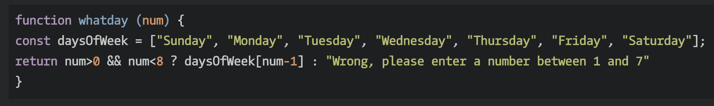

# **WHAT I LEARNED IN  WEEK 9** 
___

## `codewars`

 copied sung's solution

## `midterm`

Midterm went well. I plan to redo the midterm in my own time as there are many things i'd like to improve on. 

```javascript


```
## `uptown-func`

In this exercise we called functions within other functions. 

```javascript


```
## `Domosaur`

This activity helped us get our head around adding event listeners and some more practice with query selectors.

```javascript


```
## `Funculate`

The aim of this activity was to get the perform calculation function to take previous functions.

```javascript

```

## `Promtulate`

Practice setting up a prompt window that takes in user input and puts it in a function.

```javascript

```

## `Iffy-2`

This task followed from our previous work on building an app and led nicely from Promtulate. We worked towards making a prompt window for our app.

```javascript

```